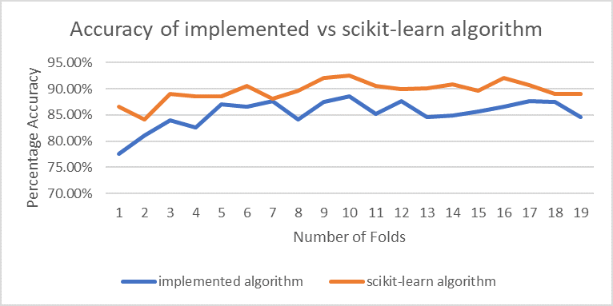

# Decision-Tree-Algorithm
Machine Learning CART (using gini index) and C4.5 (using entropy information gain) Decision Tree supervised learning algorithms implemented in Python.

Tested and compared the algorithm against the scikit-learn library on the Hazelnut dataset which attempts to classify the nut properties. 

Example of the accuracy of the implemented C4.5 using entropy against scikit-learns' C4.5 algorithm:

